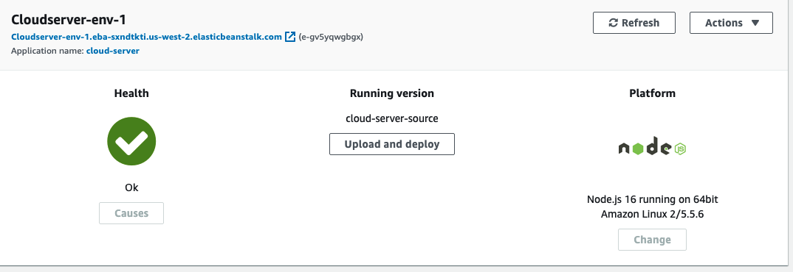
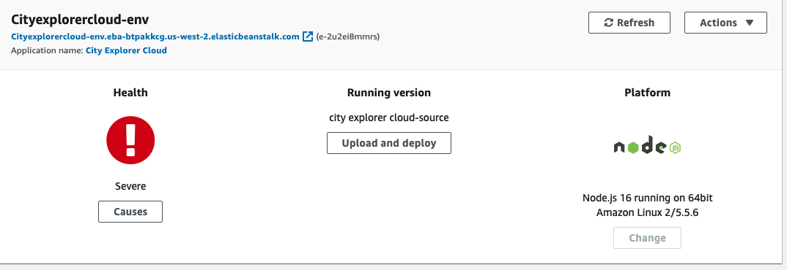
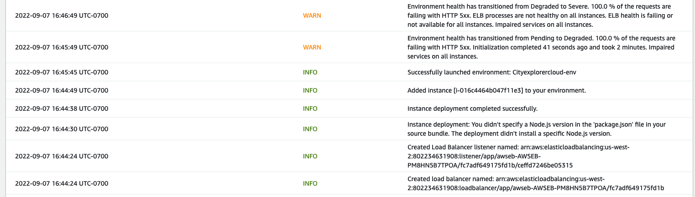

# Lab 16 - AWS: Cloud Servers 

## Deploy a Node.js server to AWS EC2

- The links to both of your deployed servers (GUI deploy and CLI deploy)
- Document your processes

### Deployment

- <http://cloudserver-env-1.eba-sxndtkti.us-west-2.elasticbeanstalk.com/>

## Approach & Efficiency
- I tried to use Can of books back end and City Explorere - API, and  I had the hardest time getting it to work. I keep getting this message and I need more guideance on how to deploy it. 

### Collaborators
 - Danny C.
